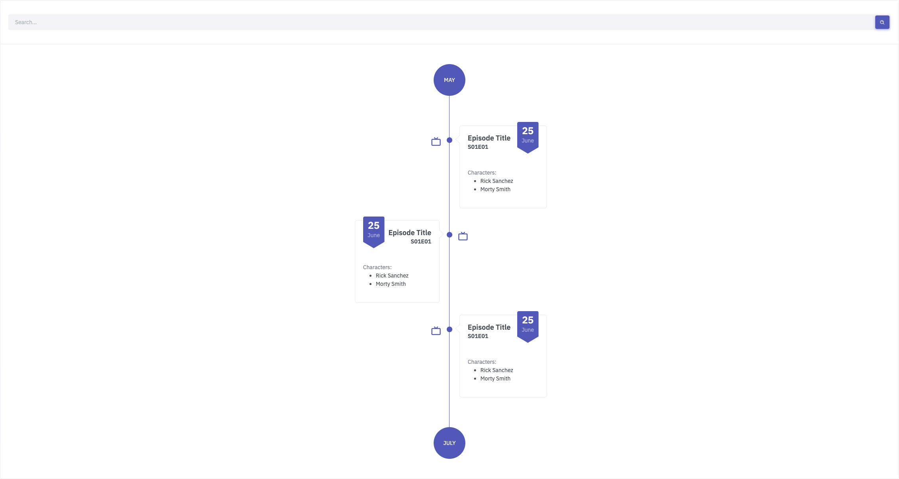

## React Developer - Technical Test

### Introduction

You are currently in a process with us and we're glad to see you here for a quick technical exercice.

There's no proper deadline for this exercice. Do it when you want and write us when you're good.

FYI this exercice has been designed for you to spend maximum 3 to 4 hours on it. However, this is just an informative number, do not stress too much about it.

### How does this test work?

The goal of this technical test is to help to assess:
- Overall **integration** skills
- Basic **React** mastery
- Code style and reflexes in terms of **code quality**
- Basic **testing** skills
- **Ease** on low info environment
- Ability to either be autonomous or ask the needed questions

The 1st part is doing this exercice.

The 2nd part is the debrief of this exercice with the team. You'll have to present us what you did, your choices, etc. and we'll take that as an opportunity to ask you questions on your test or other technical topics.

### Exercice

#### Rules & Advices

You can use any library, framework, tool or whatever you feel comfortable using and that is not conflicting with the technical requirements: React, Jest.

Make sure to read the whole document before starting to implement, you may find at the end some informations you'd like to have before starting the exercice.

#### Description

Leveraging [Rick & Morty API](https://rickandmortyapi.com/documentation/), you will have to develop a web page displaying the episodes by month on a timeline.

Browsing the API documentation link, you will be able to find all required informations to use that API. You can use REST or GraphQL (or both :man_shrugging:) mode as you prefer. You will notice that episodes have a `air_date` which is the date to use to display the episodes of the month.

Following the design on the screenshot below, display each episode on the timeline.

The round button on the top displays the previous month. When you click on it, the according month's episodes are displayed on the timeline and the button now displays the previous month.

Same behavior goes for the button at the bottom but for the next month.

Each point on the timeline links to a timeline item displaying the episode's title, date (day and month) and characters list.

The search bar is here to search for an episode by its name or episode code (i.e: S01E01). When the search is active (when there's at least 1 non-blank character in the search bar), the months round buttons disappear and the results appearing on the timeline are not restricted to only 1 month anymore.

#### Tests

You will write tests using [Jest](https://jestjs.io/).

Pro tip 1: Do not forget to include `@types/jest` in your packages.

Pro tip 2: Start by setting up jest and check that it works by writing a fake test: `expect(true).toBe(true)` before trying to implement the real tests.

In the whole process, you will need to be able to group the episodes by month. This piece of logic must be put in a dedicated function that takes a list of episodes and returns it grouped by months.

You will write  tests for this function:
- when you send an empty array it doesn't break but returns an empty array
- when you send an array of objects that are not episodes, it returns an error saying "the format of episodes data looks incorrect"
- when you send an episode from `May, 2010`, an episode from `June 2010` and another episode from `May, 2010`, it returns back 2 groups: 1 with the 2 episodes from `May, 2010`, the episode from `June, 2010`
- when you send an episode from `May, 2010`, an episode from `June 2010` and another episode from `May, 2011`, it returns back 3 groups: 1 with the episode from `May, 2010`, the episode from `June, 2010`, 1 with the episode from `May, 2011`

#### Design

#### Sum up - what's expected

- Episodes' timeline
    - 1st request displaying the episodes of the 1st month
    - Navigate through months with buttons on the top & bottom
- Search
    - Search by name or episode code
    - Search -> API call
    - Disable months buttons
    - Remove the "1 month" restriction
    - Display all results on the timeline with the same infos
- Unit Tests on the "group by month" function

### Bonus

This part is fully optional. Do it only if you think you will get fun out of it.
We recommend that you consider it quite seriously before trying to add some of the points in your technical test as it could mess it up entirely.

If you still want to give it a try, here are the points that we would love to find in your test:
- High tests  coverage (>= 80%) with tests that make sense
- Separation of concerns:
  - Level 1: logical pieces of the code not all mixed in the composants
  - Level 2: Clean / Onion / Hexagonal Architecture
- Usage of "adapters" abstracting the logic for the queries allowing to switch between REST and GraphQL by just changing the function we call
- Beautiful animations on episodes display and month switch
- React Native version
- Autosuggest on the search component
- Search cache in the local store